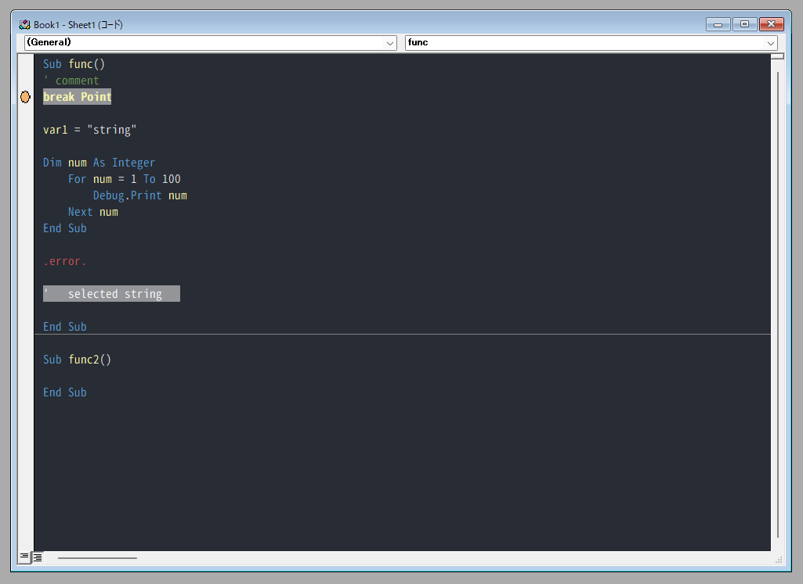

# VBEColorSchemeSetting

## これはなに
VBA のコードエディタの配色(カラーパレット)を、バッチファイルを一つ実行するだけで目に優しいカラースキームに変更します  
カラースキームはOne Half Dark をベースに色を少し追加しています  
自分で使うように作成したものですが、どなたかの役に立てばと思いリポジトリに公開しました

## 設定適用後の画面例

## 使い方
リポジトリをクローンして、 `setting.bat` を管理者権限で実行してください

## 動作確認環境
- Windows 11 Pro
- Microsoft 365 (64bit)

ウチイダが利用している環境でのみ動作確認をしています  
この他の環境、とくに Microsoft 365 以外のバージョンでは、そのままでは動かない可能性が高いです  
また、バッチファイルで動作させる都合上、Mac ではご利用いただけません  

## 利用しているツール
1. VBEThemeColorEditor
GUIで作成した16色のカラーパレットの設定をxmlファイルにまとめ、それに合わせてVBE7.dllを変更するツールです  
https://github.com/gallaux/VBEThemeColorEditor  

2. VBEThemeColorTool  
風柳 さまが作成した、VBEThemeColorEditor用のテーマファイルを適用するためのコマンドラインツールをダウンロードして実行しています  
ウチイダの環境でも、VBEThemeColorEditorではうまく設定が認識されなかったため、こちらを利用ささせていただきました  
また、コマンドひとつでカラーパレットの色を指定するレジストリ値まで変更できるため、その機能も活用させていただいてます  
https://github.com/furyutei/VBEThemeColorTool

## 参考
- VBEThemeColorEditorの不具合解消版(としじ さま):  
  設定がうまく行かなかったとき、VBEThemeColorTool の存在を知ったきっかけになったページです  
  また、バッチファイルの記述もかなり参考にしており、ほとんどこの記事のコードのまま使っています  
  https://note.com/toshi81350036/n/n2f3998462d7b

## 免責
ご利用の際には全て自己責任でお願いします  
不具合があったり、使用した結果等により万一何らかの損害を被ったりした場合でも、当方は一切関知いたしません  
